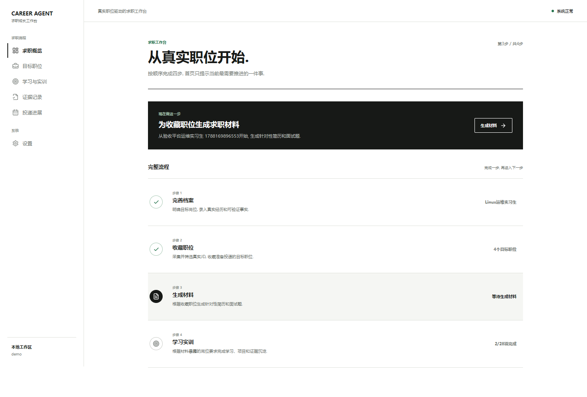
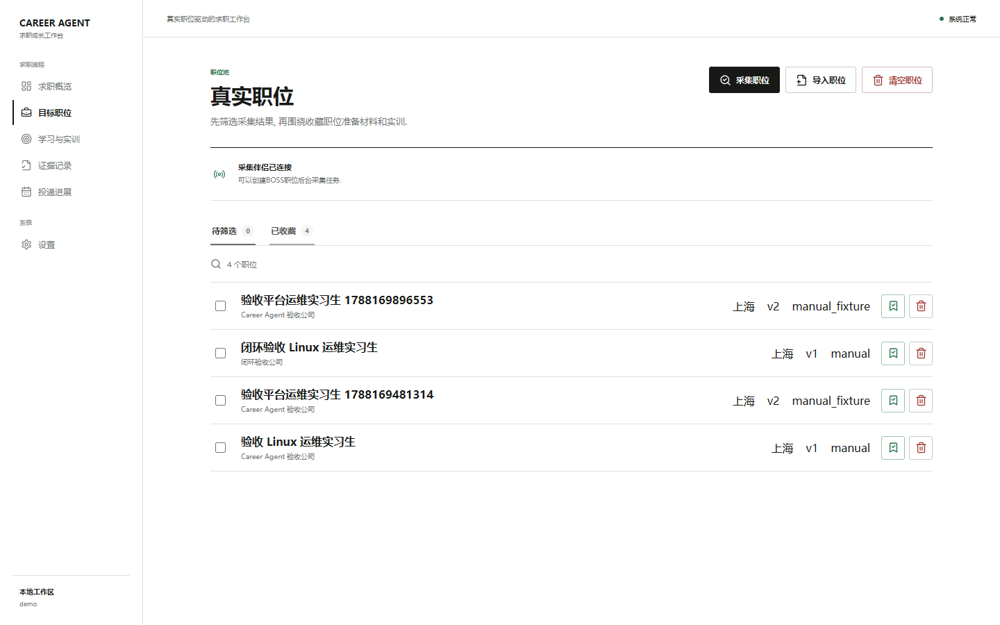
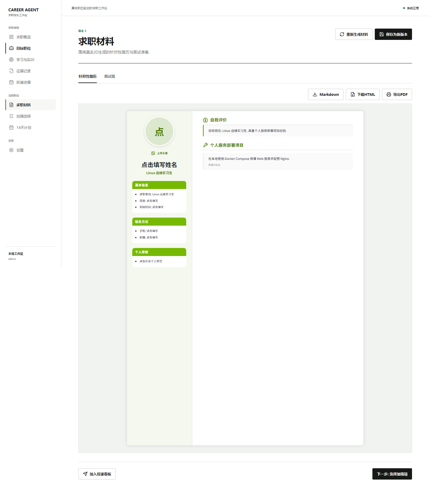

# Career Agent

从一条真实 JD 开始, 把求职准备串成一个能持续推进的闭环.

我做这个项目, 是因为收藏职位、改简历、补知识和记录投递通常散落在好几个地方. Career Agent 把这些事情放回同一条流程里: 先确定目标职位, 再生成针对性材料, 选择要加强的要求, 完成 14 天学习与实训, 最后留下证据并复盘投递反馈.



## 现在能做什么

- 导入职位 JD, 或通过本机采集伴侣创建 BOSS 职位后台采集任务.
- 筛选、收藏和批量删除职位, 为每个目标职位保留独立上下文.
- 根据真实经历和 JD 生成针对性简历、面试题, 支持后台生成和跨页面继续.
- 在线编辑 A4 简历, 保存历史版本, 下载 Markdown、HTML 或导出 PDF.
- 由用户选择要加强的岗位要求, 再生成 14 天滚动计划.
- 把计划转成知识练习和实训任务, 保存提交结果与建议性评价.
- 将完成过程沉淀到证据库, 在投递看板记录状态、反馈和下一轮行动.





## 启动

需要 Docker Desktop. 在项目根目录执行:

```powershell
docker compose -f deploy\compose.yaml up --build -d
docker compose -f deploy\compose.yaml ps
```

等待 `db`、`api`、`web` 三个服务都显示 `healthy`, 然后打开 `http://127.0.0.1:8090`.

停止服务但保留数据:

```powershell
docker compose -f deploy\compose.yaml down
```

首次进入后按首页提示推进即可: 完善求职档案 -> 收藏职位 -> 生成材料 -> 选择加强项 -> 完成学习与实训.

## 模型服务

项目默认使用 Demo Provider, 不需要 API Key 就能走通完整流程. 要使用真实模型, 进入 `设置 -> 模型服务`, 填写 OpenAI 兼容接口地址和 API Key, 拉取模型后保存并测试.

配置保存在本机 Docker 命名卷 `career_agent_config` 中. 密钥不会进入业务数据库、前端构建或后端响应. 也可以用环境变量提供初始配置:

```text
CAREER_AGENT_PROVIDER=openai-compatible
CAREER_AGENT_MODEL_BASE_URL=https://api.example.com/v1
CAREER_AGENT_MODEL_API_KEY=<secret>
CAREER_AGENT_MODEL_NAME=<model>
CAREER_AGENT_MODEL_TIMEOUT_SECONDS=180
CAREER_AGENT_MODEL_CONFIG_PATH=/app/config/model-settings.json
```

网页中保存的配置优先生效. 配置缺失时后端会明确返回 `provider_not_configured`, 不会悄悄切回 Demo.

## 本地职位采集

BOSS 采集运行在用户自己的 Windows 电脑上, 浏览器登录态和采集数据都留在本地. Web 应用只负责任务创建、状态展示和接收结构化职位.

先安装并连接 `career-collector`, 再启动后台伴侣:

```powershell
career-collector doctor
career-collector configure --agent-url http://127.0.0.1:8090 --agent-token <与 CAREER_AGENT_COLLECTOR_TOKEN 相同的 Token>
career-collector start
career-collector status
```

进入职位页点击 `采集职位`, 输入关键词、城市和数量即可. 城市会从 BOSS 公开城市目录加载并支持名称搜索. 页面会持续显示任务进度, 也可以暂停、继续或打开登录窗口处理平台要求.

采集器不会处理验证码, 不包含随机鼠标、拟人滚动等规避识别逻辑. 本项目不自动投递、不自动沟通, 也不绕过招聘平台的安全措施.

## 技术结构

- 前端: React 18、TypeScript、Vite、TanStack Query.
- 后端: FastAPI、SQLAlchemy、Alembic、PostgreSQL.
- 部署: Docker Compose、Nginx.
- 测试: Pytest、Vitest、Playwright.

生成任务由后端保存状态, 页面切换或刷新不会中断. 每份职位、材料、计划、实训、证据和投递反馈都有明确关联, 方便后续继续迭代而不是重新开始.

## 本地开发与验证

后端使用 Python 3.12, 前端使用 Node.js 18+.

```powershell
python -m pip install -e ".[dev]"
npm --prefix frontend ci
npm ci

python -m pytest -q
python -m ruff check backend\src tests
python -m mypy backend\src
npm --prefix frontend test -- --run
npm --prefix frontend run typecheck
npm --prefix frontend run build
```

端到端测试使用独立 Demo 栈, 不会把测试职位写入日常数据库:

```powershell
docker compose -p career-agent-e2e -f deploy\compose.yaml -f deploy\compose.e2e.yaml up --build -d
$env:CAREER_AGENT_E2E_BASE_URL = 'http://127.0.0.1:18090'
npx playwright test
docker compose -p career-agent-e2e -f deploy\compose.yaml -f deploy\compose.e2e.yaml down -v
```

## License

[MIT](LICENSE)
